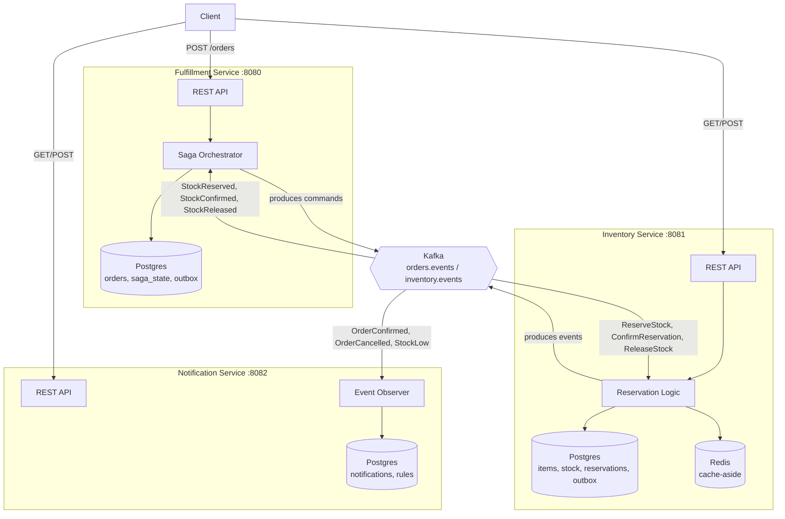
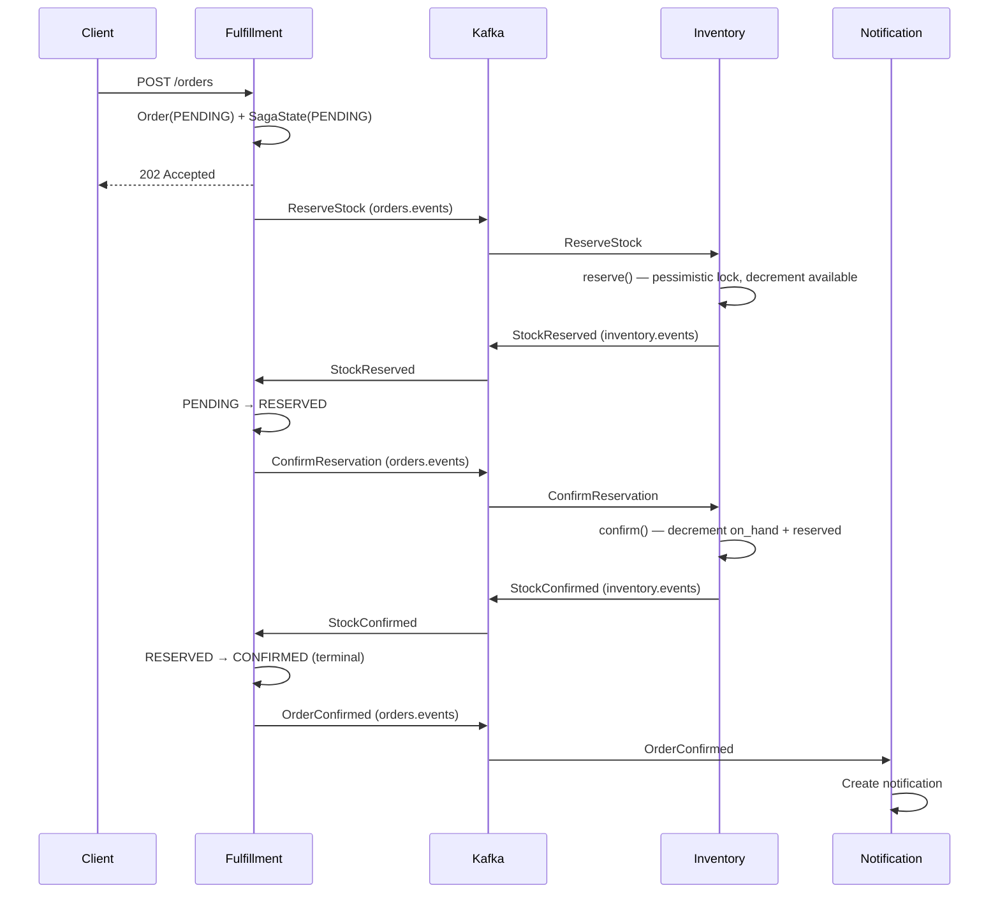

# Warehouse Order Fulfillment System

A three-service microservices system demonstrating the **Saga pattern** for
distributed transactions, built as a portfolio project targeting product-company
backend roles. Fulfillment orchestrates orders, Inventory owns stock with atomic
reservations, and Notification observes domain events — all communicating
exclusively through Kafka using the **transactional outbox pattern** for
reliable publishing and **idempotent consumers** for safe at-least-once
processing.

## Why this project exists

Most portfolio CRUD apps don't demonstrate the hard parts of distributed
systems: what happens when a multi-step business process spans services that
can each fail independently? This project answers that with a real,
runnable implementation of the Saga pattern — including the compensation
path, which is the part most tutorials skip.

## Architecture



## The Saga in motion — happy path



## Tech stack

- **Java 17**, **Spring Boot 3.4.3**
- **Apache Kafka** (KRaft mode, no Zookeeper) — async service communication
- **PostgreSQL 16** — one database per service
- **Redis** — cache-aside for Inventory's stock reads
- **Flyway** — versioned schema migrations
- **Docker Compose** — infrastructure orchestration
- **springdoc-openapi** — auto-generated Swagger UI per service

## Design patterns demonstrated

- **Saga pattern (orchestrated)** — Fulfillment holds the state machine; Inventory executes commands and reports results
- **Transactional outbox** — every service writes events to a local outbox table in the same DB transaction as its business change, then a background poller publishes to Kafka — solving the dual-write problem
- **Idempotent consumers** — every Kafka listener deduplicates via a `processed_events` table, giving effectively-exactly-once processing over Kafka's at-least-once delivery
- **Compensation** — a `CONFIRMED` order can be cancelled, triggering `ReleaseStock` → physical stock returns to the warehouse → order reaches `CANCELLED`
- **Two-layer threshold model** — Inventory's `publish_threshold` (when to emit a StockLow event) is independent from Notification's `alert_threshold` (when a human should be alerted)
- **Cache-aside with TTL** — Inventory's `GET /inventory/{sku}` caches in Redis with a 5-second TTL and explicit invalidation on every write

Full rationale for each major decision is in [`docs/adr/`](docs/adr/) as formal ADRs.

## Quick start

Ran into an issue? Check [`docs/TROUBLESHOOTING.md`](docs/TROUBLESHOOTING.md)
for real problems hit during development and their fixes.

**Prerequisites:** Docker Desktop, Java 17, Maven.

```bash
# 1. Start infrastructure (Postgres x3, Kafka, Redis)
docker compose up -d

# 2. Verify all containers are healthy
docker compose ps

# 3. Start each service (separate terminals)
cd inventory-service && mvn spring-boot:run
cd fulfillment-service && mvn spring-boot:run
cd notification-service && mvn spring-boot:run

# 4. Verify health
curl http://localhost:8081/actuator/health
curl http://localhost:8080/actuator/health
curl http://localhost:8082/actuator/health
```

Swagger UI for each service:
- Inventory: http://localhost:8081/swagger-ui.html
- Fulfillment: http://localhost:8080/swagger-ui.html
- Notification: http://localhost:8082/swagger-ui.html

## API reference

| Service | Method | Path | Purpose |
|---|---|---|---|
| Inventory | POST | `/inventory/reserve` | Reserve stock for an order |
| Inventory | POST | `/inventory/confirm` | Confirm a reservation |
| Inventory | POST | `/inventory/release` | Release a reservation (compensation) |
| Inventory | GET | `/inventory/{sku}` | Get current stock (cached) |
| Fulfillment | POST | `/orders` | Place an order (starts the Saga) |
| Fulfillment | POST | `/orders/{id}/cancel` | Cancel a confirmed order (compensation) |
| Fulfillment | GET | `/orders/{id}` | Get order + Saga state |
| Fulfillment | GET | `/orders` | List orders (filterable, paginated) |
| Notification | GET | `/notifications` | List notifications |
| Notification | POST | `/notifications/{id}/acknowledge` | Acknowledge a notification |
| Notification | POST | `/notifications/rules` | Configure a per-SKU alert threshold |
| Notification | GET | `/notifications/rules` | List configured rules |

## Demo scenarios

See [`docs/DEMO.md`](docs/DEMO.md) for copy-paste curl sequences covering:
- Happy path (order → reserved → confirmed)
- Insufficient stock (order fails cleanly)
- Compensation (confirmed order → cancelled → stock returned)
- Idempotency (safe retries at every layer)
- Two-layer stock alerting

## Project structure